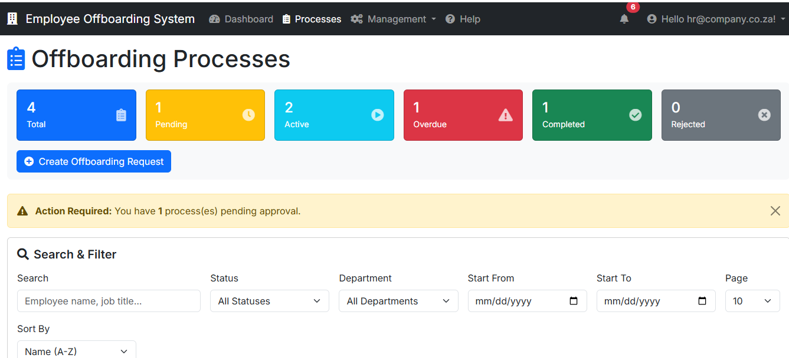
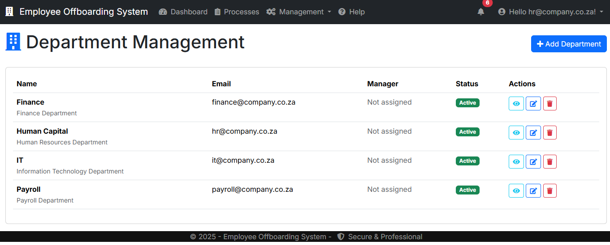
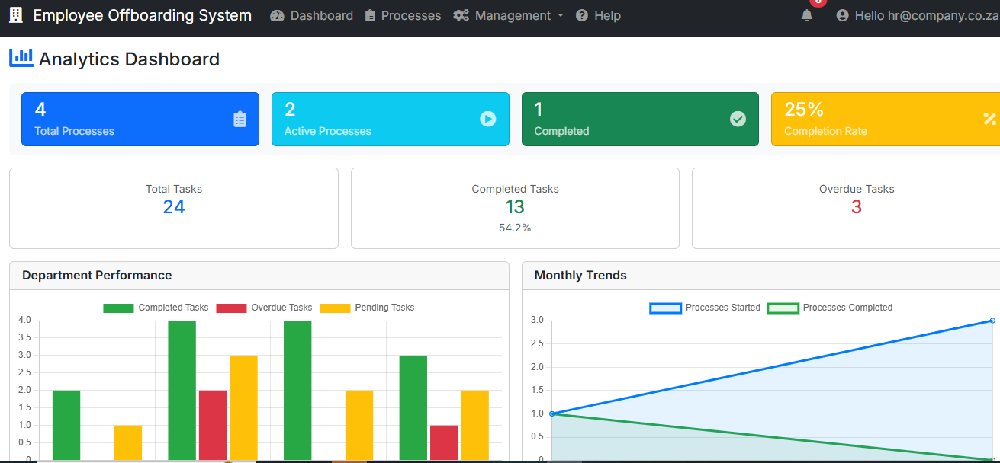
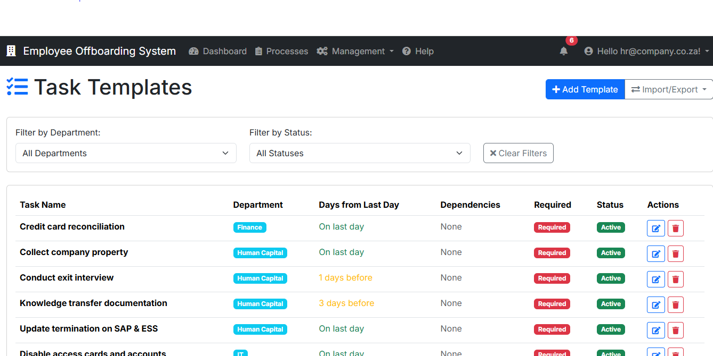

# HR Employee Offboarding Checklist System

[](https://dotnet.microsoft.com)


## Live Demo

- Production (Render): https://hr-offboarding-checklist.onrender.com/

[](https://hr-offboarding-checklist.onrender.com/)

A comprehensive Employee Offboarding Checklist System designed to streamline the employee termination process across different departments in South African companies. This enterprise-grade solution showcases advanced .NET development skills and modern software architecture.

## Screenshots

> Note: Screenshots are stored in `Documentation/Screenshots/`.

- Dashboard
  
  

- Offboarding Processes Overview
  
  

- Department Management
  
  

- Analytics Dashboard
  
  

- Task Templates
  
  

## Core Features

### Basic Functionality
- Role-based Workflow: Separate tasks for Human Capital, IT, Finance, and Payroll departments
- Progress Tracking: Real-time progress calculation and visual indicators
- Audit Trail: Complete tracking of who completed what task and when
- Dashboard Analytics: Overview of all processes with key metrics
- Responsive Design: Works seamlessly on desktop, tablet, and mobile devices

## Advanced Enterprise Features

### 1. Email Notification System
- Automated Notifications: Task assignments, completion updates, overdue reminders
- HTML Email Templates: Professional, branded email communications
- Background Service: Automated daily reminder system
- Multi-Department Routing: Intelligent email routing based on task department

### 2. Document Management System
- File Upload/Download: Secure document handling with validation
- Multiple File Types: PDF, DOC, DOCX, JPG, PNG support
- File Size Limits: 10MB max with proper error handling
- Document Categories: Exit interviews, asset returns, clearance certificates
- Security: Path traversal protection and file type validation

### 3. RESTful API Layer
- Complete REST API: Full CRUD operations for external integrations
- Swagger Documentation: Interactive API documentation at `/api-docs`
- JSON/XML Support: Multiple response formats
- Authentication: Secure API endpoints with JWT support
- Filtering & Pagination: Advanced query capabilities

### 4. Advanced Analytics & Reporting
- Interactive Charts: Department performance, monthly trends, completion distributions
- Chart.js Integration: Professional data visualizations
- Export Functionality: CSV and JSON report exports
- Performance Metrics: Completion times, success rates, top performers
- Time-based Analytics: Historical trends and patterns

### 5. Background Services
- Automated Reminders: Daily background service for overdue tasks
- Process Monitoring: Automatic progress notifications
- Data Cleanup: Archival of old completed processes
- Performance Optimization: Efficient resource usage

### 6. Performance & Optimization
- Database Indexing: Strategic indexes for fast queries
- Memory Caching: Improved response times
- Async/Await: Non-blocking operations throughout
- Entity Framework Optimization: Efficient data access patterns

## Technical Architecture

```
Controllers/
  - HomeController.cs (Dashboard)
  - OffboardingProcessesController.cs (Main CRUD)
  - AnalyticsController.cs (Advanced reporting)
  - Api/OffboardingApiController.cs (REST API)
Services/
  - EmailService.cs (Email notifications)
  - DocumentService.cs (File management)
BackgroundServices/
  - OffboardingReminderService.cs (Automated tasks)
Models/
  - OffboardingProcess.cs
  - ChecklistItem.cs
  - OffboardingDocument.cs
  - ViewModels/ (Analytics, Dashboard)
Data/
  - ApplicationDbContext.cs
  - DbInitializer.cs
Views/
  - Home/ (Dashboard)
  - OffboardingProcesses/ (CRUD operations)
  - Analytics/ (Advanced reporting)
```

## Technology Stack

### Backend
- .NET 8.0 (LTS)
- C# 12.0
- ASP.NET Core MVC / Razor Pages
- Entity Framework Core (code-first migrations)
- SQL Server LocalDB (development)
- ASP.NET Core Identity

### Frontend
- Bootstrap 5
- Chart.js
- Font Awesome
- jQuery

### DevOps & APIs
- Swagger/OpenAPI
- Docker
- Background Services

### Advanced Features
- Email Services (SMTP-ready)
- File Management (secure upload/download)
- Caching (memory cache)
- Logging (Serilog-ready)

## Business Workflow

1) Process Initiation
- HR creates new offboarding process
- System generates standard checklist
- Automated email notifications sent to departments

2) Department Execution
- Human Capital: Exit interviews, documentation, SAP updates
- IT: Asset returns, access card collection, account deactivation
- Payroll: Staff advance clearance, final pay processing
- Finance: Credit card reconciliation, expense settlements

3) Progress Monitoring
- Real-time progress tracking
- Automated reminder emails for overdue tasks
- Analytics dashboard for management oversight

4) Process Completion
- All tasks marked complete
- Process closure with audit trail
- Final notifications to stakeholders

## Getting Started

### Prerequisites
- Visual Studio 2022 or VS Code
- .NET 8.0 SDK
- SQL Server Express LocalDB

### Installation

1) Clone the repository
```bash
git clone https://github.com/AyaSox/HROffboardingChecklist.git
cd HROffboardingChecklist
```

2) Install dependencies
```bash
cd OffboardingChecklist
dotnet restore
```

3) Update database
```bash
dotnet ef database update
```

4) Run the application
```bash
dotnet run
```

5) Access the application
- Web App (local): https://localhost:5001
- API Docs (local): https://localhost:5001/api-docs
- Live Demo (Render): https://hr-offboarding-checklist.onrender.com/

## Configuration

### Email Settings (appsettings.json)
```json
{
  "EmailSettings": {
    "SmtpServer": "smtp.company.co.za",
    "SmtpPort": 587,
    "Username": "noreply@company.co.za",
    "Password": "your-password"
  }
}
```

### File Upload Settings
```json
{
  "FileUploadSettings": {
    "MaxFileSize": 10485760,
    "AllowedExtensions": [".pdf", ".doc", ".docx", ".jpg", ".png"]
  }
}
```

## Docker Deployment

### Build & Run
```bash
docker build -t offboarding-checklist .
docker run -p 8080:80 offboarding-checklist
```

### Docker Compose (with SQL Server)
```yaml
version: '3.8'
services:
  app:
    build: .
    ports:
      - "8080:80"
    environment:
      - ConnectionStrings__DefaultConnection=Server=db;Database=OffboardingDB;User=sa;Password=YourPassword123!
  db:
    image: mcr.microsoft.com/mssql/server:2022-latest
    environment:
      - ACCEPT_EULA=Y
      - SA_PASSWORD=YourPassword123!
```

## API Endpoints

### Core Operations
- GET /api/offboarding/processes - List all processes
- POST /api/offboarding/processes - Create new process
- GET /api/offboarding/processes/{id} - Get specific process
- PUT /api/offboarding/tasks/{id}/complete - Complete task

### Analytics
- GET /api/offboarding/analytics/departments - Department stats
- GET /api/offboarding/analytics/overview - System overview

### Reports
- GET /analytics/exportreport?format=csv - Export CSV
- GET /analytics/exportreport?format=json - Export JSON

## Performance Features

### Database Optimization
- Strategic indexing on frequently queried fields
- Efficient Entity Framework queries
- Proper foreign key relationships

### Caching Strategy
- Memory caching for frequently accessed data
- Cache invalidation on data updates
- Performance monitoring

### Background Processing
- Async email sending
- Automated cleanup tasks
- Resource-efficient task scheduling

## Security Features

### Authentication & Authorization
- ASP.NET Core Identity integration
- Role-based access control
- Secure password policies

### File Security
- File type validation
- Path traversal protection
- Size limit enforcement

### API Security
- Authentication required for all endpoints
- CSRF protection
- SQL injection prevention

## Contact

Developer Portfolio Project
- Repository: https://github.com/AyaSox/HROffboardingChecklist
- Live Demo (Render): https://hr-offboarding-checklist.onrender.com/
- Documentation: See /Documentation folder for detailed guides

---

This project demonstrates enterprise-level .NET development skills including background services, API design, data visualization, file management, email systems, and modern web architecture.

## Deployment

This application is deployment-ready for cloud platforms.

### Render Deployment
- Configured for SQLite in production
- Docker containerization included
- Environment variable configuration
- Automatic database migrations

### Environment Variables for Production
```bash
DATABASE_PROVIDER=Sqlite
ASPNETCORE_ENVIRONMENT=Production
SQLITE_DB_PATH=/opt/render/project/src/data/offboarding.db
```

The system automatically switches between SQL Server (development) and SQLite (production) based on configuration, ensuring seamless deployment across environments.